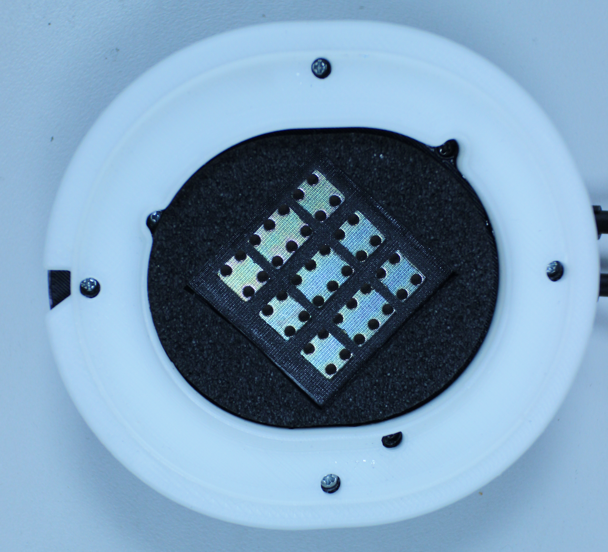

# Head-Fi Thread
- [Head-Fi Thread](#head-fi-thread)
  - [Introduction](#introduction)
  - [Open Source Alpha Preliminary Directions (if something is unclear or incorrect please post or PM me so we may revise)](#open-source-alpha-preliminary-directions-if-something-is-unclear-or-incorrect-please-post-or-pm-me-so-we-may-revise)
    - [Step 1: Remove Drivers](#step-1-remove-drivers)
    - [Step 2: Detach Fostex Baffles](#step-2-detach-fostex-baffles)
    - [Step 3:  Cup Preparation](#step-3-cup-preparation)
    - [Step 4: Baffle Preparation](#step-4-baffle-preparation)
    - [Step 5: Cup and Baffle Assembly](#step-5-cup-and-baffle-assembly)
    - [Tuning tips](#tuning-tips)
      - [Assembly Diagrams](#assembly-diagrams)
      - [Templates](#templates)
    - [3D Printing](#3d-printing)
      - [STL Printer Files](#stl-printer-files)
    - [Ordering 3D Manufactured Parts Online](#ordering-3d-manufactured-parts-online)
  - [Image Grabs of Printer Parts Orientation on Printer for Best Print Results](#image-grabs-of-printer-parts-orientation-on-printer-for-best-print-results)
This is the official guide from Dan Clark's post on Head-Fi, available [here](https://www.head-fi.org/threads/open-alpha-t50-3d-printed-headphone-project-from-mrspeakers.825868/) ([archive](https://web.archive.org/web/2019*/https://www.head-fi.org/threads/open-alpha-t50-3d-printed-headphone-project-from-mrspeakers.825868/)).

Some liberties were made to translate this to a Markdown document.

## Introduction

As a thank you to the Head-Fi community, we're pleased to share a modified version of the Alpha Dog 3D printed headphone for the community to build DIY projects and perhaps improve on the tuning and performance of the headphone.  We are posting this fully unlicensed, though we hope people will use this for personal, not commercial purposes.  
 
Note: Headphone modifications are not without risk to the headphones and their parts.  MrSpeakers takes no responsibility for any damage caused to your Fostex headphones by following the steps outlined in this guide, either as a result of errors in our documentation or execution errors on your end.  
 
In addition, this will not be a “supported” thread, we’ll help a early users with any questions or issues and then hope the community is self-sustaining.  We’ll check in time to time to see how it’s going.  We will not answer questions for you via telephone or email. We’ll think about answering your question if you send a telegram, candy-gram, wire, bat signal, smoke signal, carrier pigeon, or a package with treats for the staff.  Most importantly have fun doing this and don’t be afraid to ask the community for help. 
 
 
## Open Source Alpha Preliminary Directions (if something is unclear or incorrect please post or PM me so we may revise)
 
### Step 1: Remove Drivers
1. Start with a Fostex T50RPx, T40RPx, or T20RPx.
2. Remove ear pads
3. Unscrew baffle.  NOTE: the internal leads to the driver are short, when the baffle detaches open it carefully.  If you pull a lead hard it will tear the solder pad off the driver and your driver is bricked. 
4. Desolder the driver leads.  Work fast, you do not want to overheat the pad.  Blow on the solder pad cool it as soon as the leads are removed to reduce risk of delamination.
5. This step is optional but recommended.  The Fostex driver has two layers of protection over it, a fine screen and a thin black felt. Using a very sharp exacto knife, cut through the black felt and follow the obvious square seam that surrounds the driver, then peal the felt back.  Try to leave the mesh in place.  If the mesh comes away you can tack it down with cement around he periphery, or leave it off completely if you are using Alpha Pads, as the pads have a dust screen built in.  See Fig XX to visualize what the driver looks like with the felt removed.
6. Repeat for the other driver
7. Unscrew the three screws on the ear-side of the baffle to detach drivers from the baffle.  Store the baffle screws in your zip lock bag for later use.
8. Set drivers to side, and put baffles in your “discard” pile
 
### Step 2: Detach Fostex Baffles

1. Using wire snippers, cut the small wire where it enters both sides of th headband, cutting as close as you can to the plastic the wire feeds into.
2. At the interior center of each cup is a raised post.  Using a thin, flat blade, gently pry the plastic cover off the post.
3. Unscrew the large silver Phillips screw.
4. Detach the cup from the headband and shake out the screw AND the ball socket it holds in place.
5. Collect the plastic end caps from the slider, the screws and the plastic ball join and store them in your zip lock bag.  DO NOT LOOSE THESE PLASTIC PARTS unless you wish to buy another T50.
 
### Step 3:  Cup Preparation

Refer to the Open Source Alpha, Exlpoded View PDF
Solder wire leads to the HiRose jack, a 1.5” 28AWG multi-stranded wire is fine.  Heavier gauge is not recommended as stiff wire may stress on the driver pads (pinout is in the Open Source Alpha, Exploded View PDF
Before assembly, line the cup with acoustic foam, such as Akasa Paxmate.
Install the HiRose jack and secure it in place with the nut.  Depending on the printer some material may need to be removed from the cup inner wall to allow the nut to rotate.  We recommend use of Loctite 243 to ensure the part stays put
Fill the cup with your choice of damping material.  Alpha dogs used cotton, Alpha Prime switched to wool.  Experiment and have fun.

_Fig1 :  Detail of acoustic foam lining cup_

 
_Fig 2: Cup with acoustic foam and cotton fill_

### Step 4: Baffle Preparation

1. Refer to the file Open Source Alpha, Baffle Assembly PDF
2. Glue the two pieces of the baffle together, making sure the glue provides a continuous 360-degree seal.  Apply weight (e.g. a book with a 10 lb weight on it) until the parts are thoroughly bonded
3. Install the driver to the baffle using the Fostex screws you stored in the zip lock bag.  Be certain the foam gasket is in place; a poor fit here may reduce bass output.

> - If your baffle surface is rough (depends on the printer) you may wish to prep it by washing quickly with acetone to fuse the ABS material, or by using silicone glue in place of the foam gasket.
> - DO NOT OVERTIGHTEN THE BAFFLE SCREWS.  The Fostex driver is made of a plastic that can easily be stripped or even cracked by excessive force.  Use a gentle touch.  A stripped screw can be rethreaded with a larger screw but the risk of cracking the plastic is high.

 
_Fig 3:  Fostex driver installed in baffle assembly (note: felt cut away from driver per Step 1 line 5)_

### Step 5: Cup and Baffle Assembly

1. Put the plastic cap pieces on the T50RP arm
2. Place the cup over the plastic cap, insert the Arm Pivot Ball into the well in the cup and screw the assembly together with a #2 Phillips.   Check that the cup rotates smoothly.  Some printers may undersize the hole or leave residue that must be cleared before the joint moves smoothly.  Your results may vary based on the printer.
3. Carefully solder the positive lead to the + pad on the driver and negative lead to the – pad.  As before, working quickly is essential lest you damage the driver.  Do not add solder, use the material on the pad and heat it only until the solder wicks into the wire, then remove the heat, keep the wire in contact with the pad and blow to cool and set the solder as fast as possible.
4. Check across the driver to ensure the resistance is between 45 and 55 ohms (Fostex drivers vary), if it’s higher you may have a damaged trace on your driver, if it’s lower you may have a solder bridge or short)
5. Per the exploded view drawing, apply a thin bead of silicone glue to the baffle where it lays on the rim of the cup.  Failure to seal this seam will result in unbalanced bass response.  Alternatively, you may use a thin, very soft closed cell foam tape (must compress to less than 1mm thick).  Foam tape allows easier opening and closing of the cup for tuning.
6. Attach the baffle to the cup using the #2-28 screws.  Tighten enough to ensure a snug fit from the baffle to the cup.  Do not over tighten, if you strip the screws you’ve probably lost the cup.
7. Apply foam or felt around the driver (ear side of the baffle).  Wool felt has the most absorption across a broad range; if your headphone sounds hot, consider felt.  Foams generally do a bit less.
8. Attach your cable to the headphone and check the impedance across each channel one last time to verify it’s between 45 and 55 ohms.

Fig 4: Baffle ready to attach to cup

At this point, you are essentially done.  Tuning the headphone is easy enough, just remove the baffle to change internal damping materials, or cover the bass vents/insert small screws to tune and balance bass.  

*IMPORTANT NOTE:  3D printed plastic is quite tough, however screw holes can vary in strength depending on your printer.  Tuning requires repetitive opening and closing of the parts, and care is required to ensure screw holes do not strip.*

### Tuning tips

The paper on the back of the Fostex driver has a significant effect on 1KHz and up.  We have found significant variation in driver frequency response on the T50RP driver modules.  These variations may often be addressed by manipulating the back of the driver in the following ways:  
If you have too much midrange in the 1-3K range, placing an “air tight” object on the back of the driver reduces airflow and increases damping.  Any solid adhesive material will do, you can use a tape with a good adhesive or even felt anti-skip bumpers from an Ace hardware.  The more blocking material you apply to the driver the lower the upper midrange outputs (you may see an increase in high frequency output as well). Note some adhesives may clog the paper and continue to affect performance even if you remove the blocking part.  
If you are not getting enough bass or mid-bass output, you may consider making a small perforation (e.g. a 3mmx3mmx3mm triangle) in the exposed paper.  This is obviously a non-reversible action and should you not like it, may require additional modifications to the driver to re-balance it.  

#### Assembly Diagrams

|Document|Link|
|--------|----|
|Baffle Assembly|[Link](./design-documents/plans/baffle-assembly.pdf)
|Bass Tuning|[Link](./design-documents/plans/bass-tuning.pdf)
|Exploded View|[Link](./design-documents/plans/exploded-view.pdf)

#### Templates

|Document|Image|PDF|
|Acoustic Foam|[Link](./design-documents/stencils/img/acoustic-foam.png)|[Link](./design-documents/stencils/pdf/acoustic-foam.pdf)|
|Baffle Ring|[Link](./design-documents/stencils/img/baffle-ring.jpg)|[Link](./design-documents/stencils/pdf/baffle-ring.pdf)|
|Gasket|[Link](./design-documents/stencils/img/gasket.jpg)|[Link](./design-documents/stencils/pdf/gasket.pdf)|

### 3D Printing

#### STL Printer Files

|File|Link|
|----|----|
|All official files|[Link](./stl/official.zip)|
|Adjustable bass earcups|[Link](./stl/adjustable-cups.zip)|

### Ordering 3D Manufactured Parts Online
If you do not own or have access to a 3D printer you may procure parts from Shapeways.  Our parts are sold "at cost," we're not adding any markup to the models.  The Shapeways store is [mrspeakers](https://www.shapeways.com/shops/mrspeakers)

Note: Shapeways parts will be heavier than conventionally manufactured additive 3D printed parts, and will have solid walls.

## Image Grabs of Printer Parts Orientation on Printer for Best Print Results 

EDITABLE FILE FORMATS FOR PARTS
 
IGES
 
PARASOLID